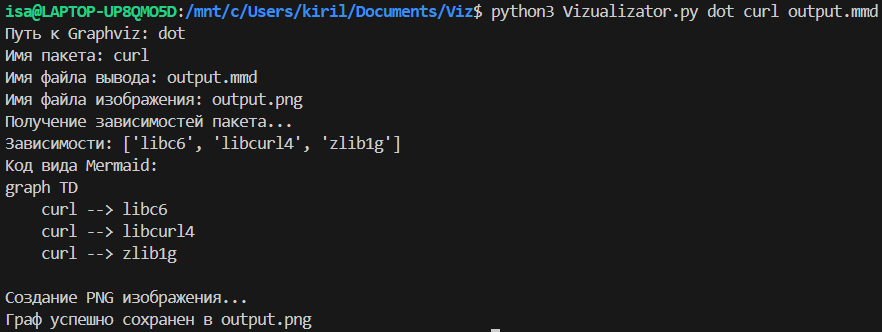
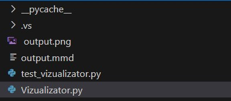
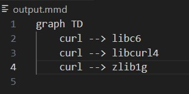
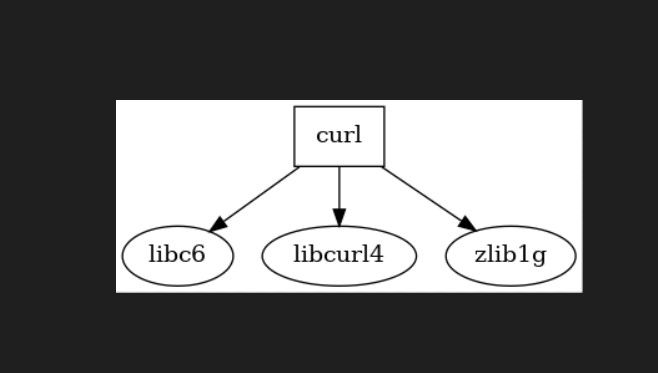
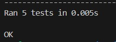

# Visualizer
Второе домашнее задание по Конфигурационному Управлению

## Постановка задачи

### Задание №1
Разработать инструмент командной строки для визуализации графа
зависимостей, включая транзитивные зависимости. Сторонние средства для
получения зависимостей использовать нельзя.
Зависимости определяются по имени пакета ОС Ubuntu (apt). Для описания
графа зависимостей используется представление Mermaid. Визуализатор должен
выводить результат на экран в виде кода.
Ключами командной строки задаются:
- Путь к программе для визуализации графов.
- Имя анализируемого пакета.
- Путь к файлу-результату в виде кода.

Все функции визуализатора зависимостей должны быть покрыты тестами.

Для запуска ввести в консоль: 

```python3 Vizualizator.py "путь к программе визуализатору (Graphviz)" "имя_пакета" "название.mmd"```

Для запуска тестов ввести в консоль: 

```python3 -m unittest test_vizualizator.py```

## Описание алгоритма

1. Функция get_package_dependencies(package_name):

- Использует subprocess.run для выполнения команды apt-cache depends <package_name>.
- Записывает стандартный вывод в переменную, затем анализирует его, чтобы извлечь зависимости (строки, начинающиеся с "Depends:" и "Recommends:").
- Возвращает список зависимостей или печатает сообщение об ошибке в случае неудачи.

2. Функция create_mermaid_graph(package_name, dependencies):

- Создает строку, представляющую граф в формате Mermaid, который определяет визуализацию зависимостей для указанного пакета.

3. Функция generate_graphviz(package_name, dependencies):

- Создает строку, представляющую граф в формате DOT для Graphviz.

4. Функция save_graph_to_png(dot_file, graphviz_path):

- Принимает имя файла DOT и путь к Graphviz и использует его для генерации PNG-изображения графа зависимостей.
- Печатает сообщение об успехе или ошибке.

5. Основная функция main():

- Проверяет количество аргументов командной строки. Если аргументы не соответствуют необходимым, выводит сообщение об использовании и завершает работу.
- Извлекает аргументы: путь к Graphviz, имя пакета, имя файла для вывода графа Mermaid.
- Выводит информацию о входных данных.
- Получает зависимости пакета, используя get_package_dependencies().
- Если зависимости найдены, создает графы (в формате Mermaid и Graphviz) и сохраняет их в соответствующие файлы.
- Вызывает save_graph_to_png() для создания PNG-изображения.
- Удаляет временный файл DOT после его использования.

## Тестирование программы

1. Вывод программы:



2. Появившиеся новые файлы:



3. Вид файла с кодом:



4. Вид png файла с графиком:



5. Unittest:


